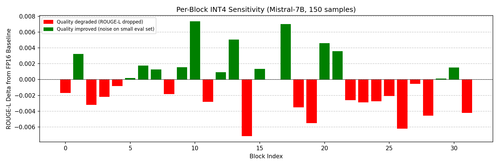
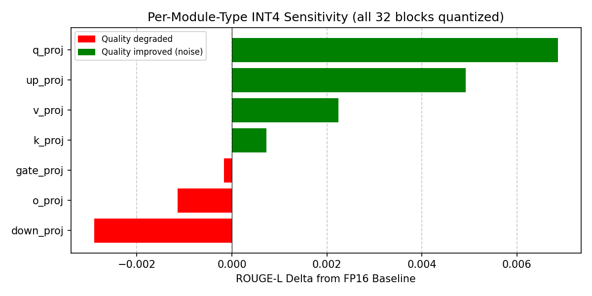

<!-- markdownlint-disable MD036 -->

# Efficient LLM Fine-Tuning & Quantization

Systematic comparison of adaptation (LoRA/QLoRA) and compression (PTQ/GPTQ/AWQ/QAT) for Mistral-7B on CNN/DailyMail summarization, on a single A100 GPU.

---

## TL;DR

**Best method: LoRA → merge → selective QAT (250 steps) → AWQ INT4**

- **0.201 ROUGE-L** — 0 pt drop vs FP16 fine-tuned baseline
- **368 tok/s** — +108% vs FP16 baseline
- **4.90 GB VRAM** — 67% reduction vs FP16
- Passes all 3 KPI gates: quality ≤ 2pt drop, latency ≤ 20% regression, VRAM ≤ 10 GB

---

## Motivation

Most LLM deployment guides benchmark quantization methods in isolation on base models. In practice, you fine-tune *then* compress, and the interaction between adaptation and quantization is where quality breaks. This project systematically measures that interaction — LoRA/QLoRA adaptation followed by PTQ/GPTQ/AWQ/QAT — on a single GPU, with explicit KPI gates (quality, latency, VRAM) to produce a data-driven deployment recommendation.

---

## Problem Statement

How to adapt and compress a 7B-parameter LLM for summarization on a single 24 GB GPU, while staying within memory, latency, and quality budgets?

| Constraint     | Threshold                              |
|----------------|----------------------------------------|
| Inference VRAM | ≤ 10 GB (quantized) / ≤ 16 GB (FP16)   |
| Latency        | ≤ 20% regression vs FP16 (tok/s p50)   |
| Quality        | ≤ 2 pt ROUGE-L drop                    |

**Setup:** Mistral-7B-v0.3 · CNN/DailyMail (~10k training samples) · single A100 GPU

---

## Pipeline

```bash
Data → LoRA/QLoRA Adaptation → Merge → Per-Layer Sensitivity Analysis → Selective QAT → PTQ/GPTQ/AWQ Export → Evaluation
```

---

## Results

### Inference Comparison (All Methods)

| Method                  | ROUGE-L   | Greedy tok/s p50 | Peak VRAM (GB) | Model Size (GB) | KPI Pass?   |
|-------------------------|-----------|------------------|----------------|-----------------|-------------|
| Base Mistral-7B (FP16)  | 0.139     | 174.0            | 14.79          | 13.50           | —           |
| LoRA scratch (r=16)     | 0.183     | 178.5            | 14.53          | 13.50           | ✅          |
| LoRA PEFT (r=2)         | 0.201     | 177.2            | 14.53          | 13.50           | ✅          |
| QLoRA (r=2, 4-bit)      | 0.201     | 69.8             | 5.88           | 4.26            | ❌ latency  |
| PTQ INT8 (LoRA-merged)  | 0.196     | 109.5            | 8.13           | 7.01            | ❌ latency  |
| PTQ NF4 (LoRA-merged)   | 0.201     | 285.2            | 5.21           | 4.16            | ✅          |
| GPTQ INT4 (LoRA-merged) | 0.196     | 84.4             | 4.91           | 3.88            | ❌ latency  |
| AWQ INT4 (LoRA-merged)  | 0.196     | 341.1            | 4.96           | 3.88            | ✅          |
| QAT BF16 (LoRA)         | 0.200     | 170.9            | 14.53          | 13.50           | ❌ VRAM     |
| GPTQ INT4 (QAT)         | 0.200     | 85.4             | 4.90           | 3.88            | ❌ latency  |
| **AWQ INT4 (QAT)**      | **0.201** | **368.1**        | **4.90**       | **3.88**        | **✅ best** |

> **Throughput caveat:** Base and fine-tuned models produce different output lengths (~200 vs ~40 tokens). Compare tok/s *within* the same model family only.

Full Results analysis in [`docs/results.md`](docs/results.md).

### Training Cost

| Method                     | Peak VRAM (GB) | Train Time (min) | Fits 24 GB? |
|----------------------------|----------------|------------------|-------------|
| LoRA (PEFT, FP16 base)     | 56.15          | 7.84             | No          |
| QLoRA (4-bit base)         | 45.46          | 9.20             | No          |
| QLoRA + Grad Checkpointing | 9.99           | 12.92            | **Yes**     |
| QAT (selective, bf16)      | 28.7           | 14.08            | No          |

### LoRA Rank Sweep

| Rank | ROUGE-L | ROUGE-Lsum |
|------|---------|------------|
| 2    | 0.201   | 0.264      |
| 4    | 0.192   | 0.254      |
| 8    | 0.197   | 0.257      |
| 16   | 0.192   | 0.248      |
| 32   | 0.193   | 0.259      |
| 64   | 0.184   | 0.249      |

r=2 dominates — higher rank overfits on this dataset (~10k samples). VRAM and throughput are constant across ranks after merging.

### QLoRA Rank Sweep

| Rank | ROUGE-L | ROUGE-Lsum |
|------|---------|------------|
| 2    | 0.201   | 0.263      |
| 4    | 0.201   | 0.262      |
| 8    | 0.191   | 0.253      |
| 16   | 0.192   | 0.253      |
| 32   | 0.189   | 0.254      |
| 64   | 0.180   | 0.243      |

Same rank ordering as LoRA: r=2 wins, r=64 is worst. r=2 and r=4 are tied here — 4-bit base quantization acts as implicit regularization, making the model less sensitive to adapter rank at the low end.

---

## Key Findings

1. **Lower rank wins on small data.** r=2 beat r=64 by 2.1 pt ROUGE-L — extra capacity overfits noise rather than learning signal.
2. **Scratch LoRA validates against PEFT** within 0.9 pt — confirms custom implementation correctness.
3. **NF4 is faster than FP16** for autoregressive decode. Generation is memory-bandwidth-bound; 4-bit weights read 3× fewer bytes from HBM, and dequantization is hidden behind the memory transfer on A100.
4. **AWQ dominates GPTQ on throughput** (341 vs 84 tok/s) at identical quality — GPTQ's `auto_gptq` Triton kernels are the bottleneck.
5. **Sensitivity analysis identified blocks 14, 26, 19** as most fragile under INT4; `down_proj` and `o_proj` are the sensitive module types (output projections feed directly into the residual stream).
6. **Selective QAT (250 steps, 3 blocks) recovers full quality.** Targeted fake-quant on sensitivity-identified layers is sufficient — no need to QAT the entire model.
7. **QAT → AWQ is the optimal pipeline.** 0 pt quality drop, +108% throughput, 67% VRAM reduction. QAT prepares sensitive layers to survive INT4 rounding.
8. **What you quantize matters more than how.** Base GPTQ: 0.142 → LoRA-merged GPTQ: 0.196 (+5.4 pt). Fine-tuning before quantization closes the quality gap entirely.

### Per-Layer Sensitivity




---

## When to Use What

| Scenario                          | Method               | Why                                                         |
|-----------------------------------|----------------------|-------------------------------------------------------------|
| Training VRAM ≤ 24 GB             | QLoRA + grad ckpt    | Only method that fits a single consumer GPU (9.99 GB peak)  |
| Training VRAM available           | LoRA (FP16 base)     | Faster convergence, better throughput                       |
| No training budget                | AWQ INT4             | Zero-cost, best throughput among PTQ methods                |
| Quality recovery after PTQ        | Selective QAT        | 250 steps on sensitive layers recovers 0.5–1 pt             |
| Maximum quality, latency ok       | LoRA merged (FP16)   | No quantization overhead                                    |
| Long-context production (2k+ tok) | QAT-recovered INT8   | INT4 errors compound over sequence length                   |

---

## Implementation Highlights

- **LoRA from scratch** — `LoRALinear` layer with forward, init, alpha/rank scaling, merge/unmerge, save/load — validated against HuggingFace PEFT within 0.9 pt ROUGE-L
- **Per-layer sensitivity analysis** — quantize one layer to INT4, keep rest FP16, measure isolated ROUGE-L delta across all 32 blocks × 7 module types (224 experiments)
- **Selective QAT** — fake-quant observers inserted only into sensitivity-identified layers (blocks 14/26/19, `down_proj` + `o_proj`), not full model
- **Full evaluation harness** — ROUGE, latency (tok/s p50, TTFT), peak VRAM, model size — with automated KPI gate checking

---

## Failure Analysis (Selected)

| # | What broke                                             | Root cause                                                      | Lesson                                                                |
|---|--------------------------------------------------------|-----------------------------------------------------------------|-----------------------------------------------------------------------|
| 1 | Higher rank degraded quality (r=64: -2.1 pt vs r=2)    | Overfitting on ~10k samples                                     | Always sweep rank; don't assume higher is better                      |
| 2 | QLoRA doesn't fit 24 GB without grad checkpointing     | Activations dominate VRAM, not model weights (45 GB peak)       | "QLoRA fits consumer GPUs" only holds with grad checkpointing enabled |
| 3 | QLoRA beam search throughput collapsed 3×              | Dequantization overhead amplified by num_beams per forward pass | Benchmark your actual decoding strategy, not just greedy              |
| 4 | GPTQ "base" eval silently loaded wrong checkpoint      | Config `checkpoint_dir` pointed to LoRA-merged folder           | Log model path at load time; configs are mutable state                |
| 5 | NF4 faster than FP16 (counterintuitive)                | Decode is memory-bandwidth-bound; 3× fewer bytes from HBM       | "Quantization = slower" only holds for compute-bound workloads        |
| 6 | Mid-network blocks most INT4-sensitive, not first/last | Blocks 14, 26, 19 degrade most; block 0 ranked 15th             | Don't assume embedding-adjacent layers are most fragile — measure     |

Full failure analysis with 13 documented cases in [`docs/concepts/failure_analysis.md`](docs/concepts/failure_analysis.md).

---

## Project Structure

```bash
src/finetuning/            # Core pipeline: data, model, training, evaluation, quantization
  ├── training/            # LoRA (scratch + PEFT), QLoRA, QAT training
  ├── quantization/        # PTQ, GPTQ, AWQ, QAT, sensitivity analysis
  ├── evaluation/          # ROUGE, latency, memory, comparison tools
  └── inference/           # Base, LoRA, QLoRA, TensorRT inference
configs/                   # YAML configs for model, data, training, quantization
scripts/                   # Reproducible shell scripts for every experiment
benchmarks/                # Benchmark runners for LoRA, PTQ, QAT comparisons
tests/                     # Unit + smoke tests (LoRA layer, PTQ, QAT, sensitivity)
docs/                      # Concept deep-dives, results, failure analysis
```

---

## Quick Start

```bash
pip install -r requirements.txt

# LoRA fine-tuning (PEFT)
bash scripts/run_lora_peft.sh

# Quantize with AWQ INT4
bash scripts/run_ptq_awq_int4.sh

# Evaluate
bash scripts/run_evaluate_task.sh

# Full comparison
bash scripts/run_compare.sh
```

---

## Caveats

- All results are from CNN/DailyMail summarization with ~10k training samples. Optimal method and hyperparameters will differ by task, dataset size, and sequence length.
- Throughput comparisons are only valid within the same model family (base vs base, LoRA vs LoRA) due to differing output lengths.
- GPTQ throughput is bottlenecked by `auto_gptq` Triton kernels; ExLlama/Marlin backends would likely recover 2–3× speed.
